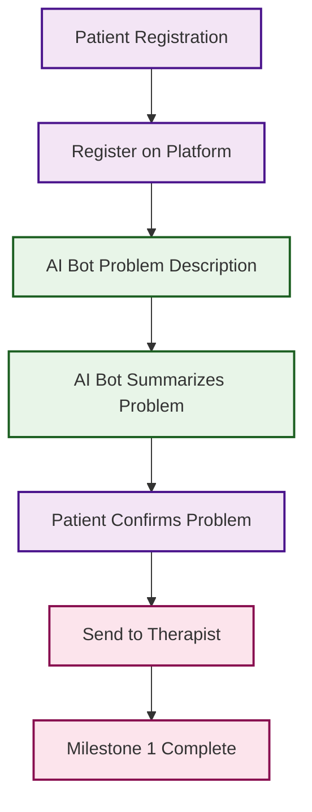
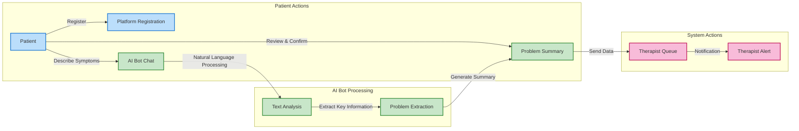
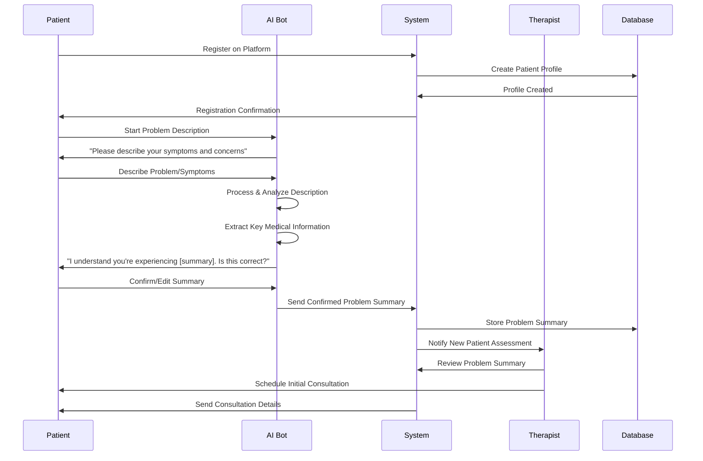
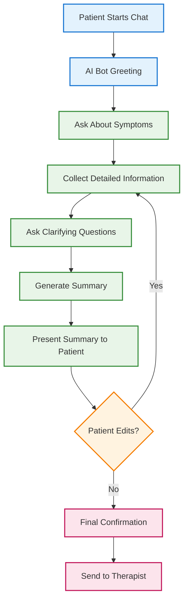
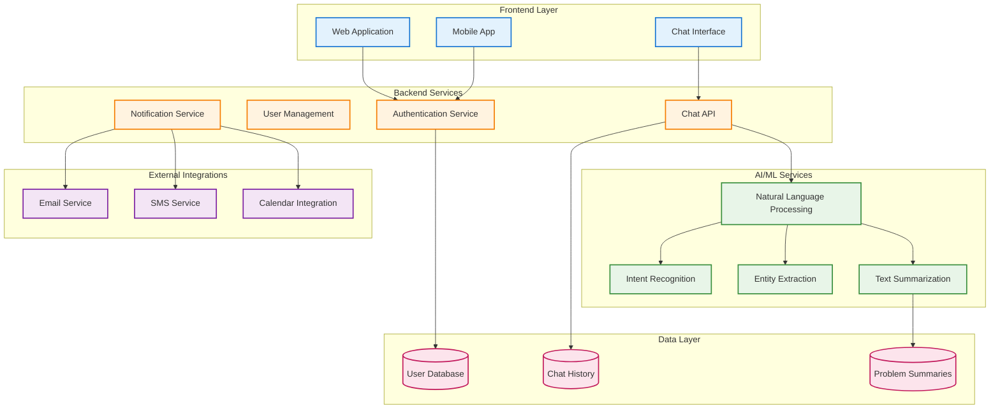
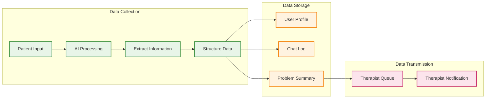

# Milestone 1: Patient Registration & AI Bot Assessment

## Overview
This milestone covers the initial patient onboarding process where patients register on the platform, describe their problems to an AI bot, and get their issues summarized and sent to a therapist for initial consultation.

## High-Level Flow

## Detailed User Interactions

## Detailed Sequence Diagram

## AI Bot Conversation Flow

## System Architecture for Milestone 1

## Key Features & Requirements

### Patient Experience
- **Simple Registration**: Quick signup with basic information
- **Intuitive Chat Interface**: Natural conversation with AI bot
- **Real-time Feedback**: Immediate responses and clarifications
- **Summary Review**: Ability to edit and confirm problem summary
- **Clear Next Steps**: Transparent process for what happens next

### AI Bot Capabilities
- **Natural Language Understanding**: Process complex medical descriptions
- **Intent Recognition**: Identify the type of problem (pain, mobility, etc.)
- **Entity Extraction**: Extract key medical terms, body parts, symptoms
- **Contextual Clarification**: Ask relevant follow-up questions
- **Summary Generation**: Create clear, structured problem summaries
- **Confirmation Flow**: Ensure accuracy before sending to therapist

### System Requirements
- **Secure Data Handling**: HIPAA-compliant data storage and transmission
- **Real-time Processing**: Fast AI responses for smooth user experience
- **Scalable Architecture**: Handle multiple concurrent users
- **Integration Ready**: Connect with therapist scheduling and notification systems
- **Audit Trail**: Complete logging of all interactions

## Data Flow

## Success Metrics

### Patient Engagement
- **Registration Completion Rate**: % of users who complete registration
- **Chat Completion Rate**: % of users who complete the full AI bot conversation
- **Summary Accuracy**: % of patients who confirm the AI-generated summary
- **Time to Complete**: Average time from registration to therapist notification

### AI Bot Performance
- **Response Time**: Average time for AI bot responses
- **Intent Recognition Accuracy**: % of correctly identified user intents
- **Entity Extraction Accuracy**: % of correctly extracted medical entities
- **Summary Quality**: Therapist satisfaction with AI-generated summaries

### System Performance
- **Uptime**: System availability percentage
- **Concurrent Users**: Maximum users supported simultaneously
- **Data Processing Time**: Time from input to summary generation
- **Integration Success**: % of successful therapist notifications

## Technology Stack

### Frontend
- **Web**: React/TypeScript with Material-UI
- **Mobile**: React Native or Flutter
- **Chat Interface**: Custom chat component with typing indicators

### Backend
- **API**: Node.js/Express or Python/FastAPI
- **Authentication**: JWT tokens with OAuth2
- **Real-time**: WebSocket connections for chat

### AI/ML
- **NLP**: OpenAI GPT-4 or Google BERT
- **Intent Recognition**: Rasa or Dialogflow
- **Entity Extraction**: spaCy or AWS Comprehend Medical
- **Text Summarization**: Custom models or API services

### Data & Infrastructure
- **Database**: PostgreSQL for structured data, Redis for caching
- **Cloud**: AWS/Azure with auto-scaling
- **Monitoring**: Application performance monitoring and logging
- **Security**: End-to-end encryption, HIPAA compliance

This milestone establishes the foundation for the entire physiotherapy workflow by ensuring smooth patient onboarding and effective problem assessment before therapist consultation.
