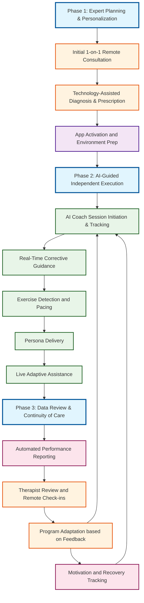
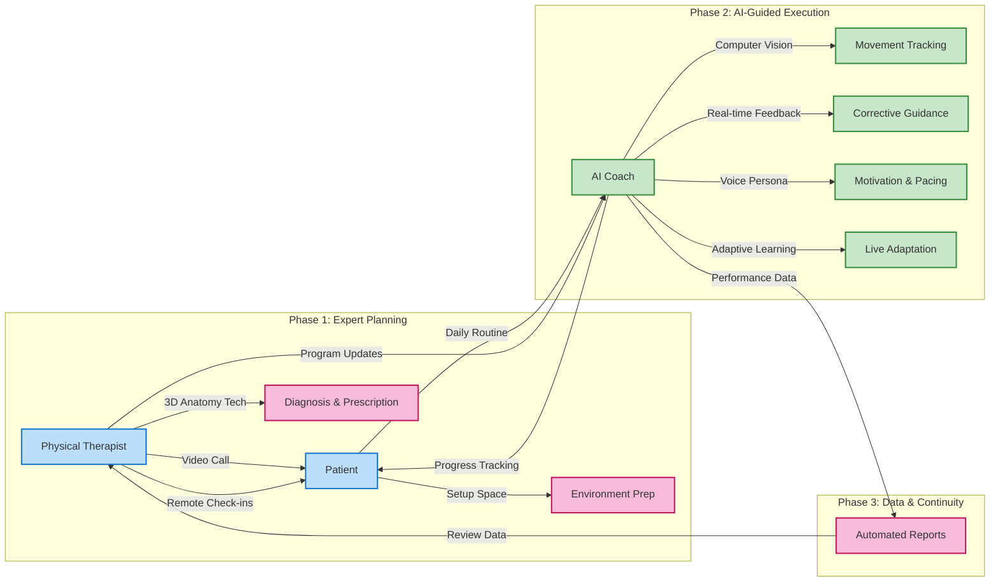
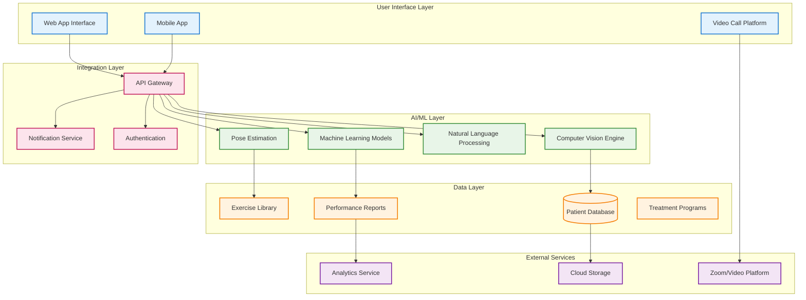
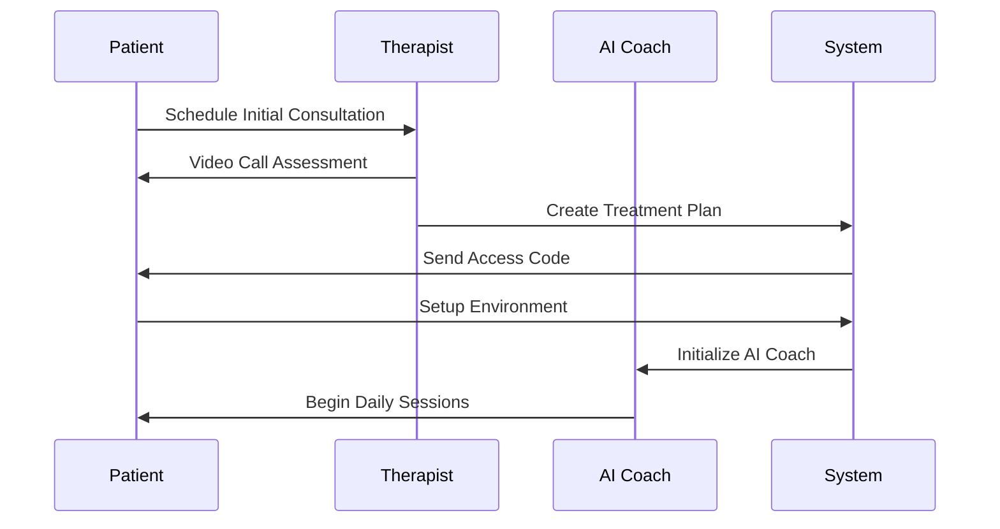
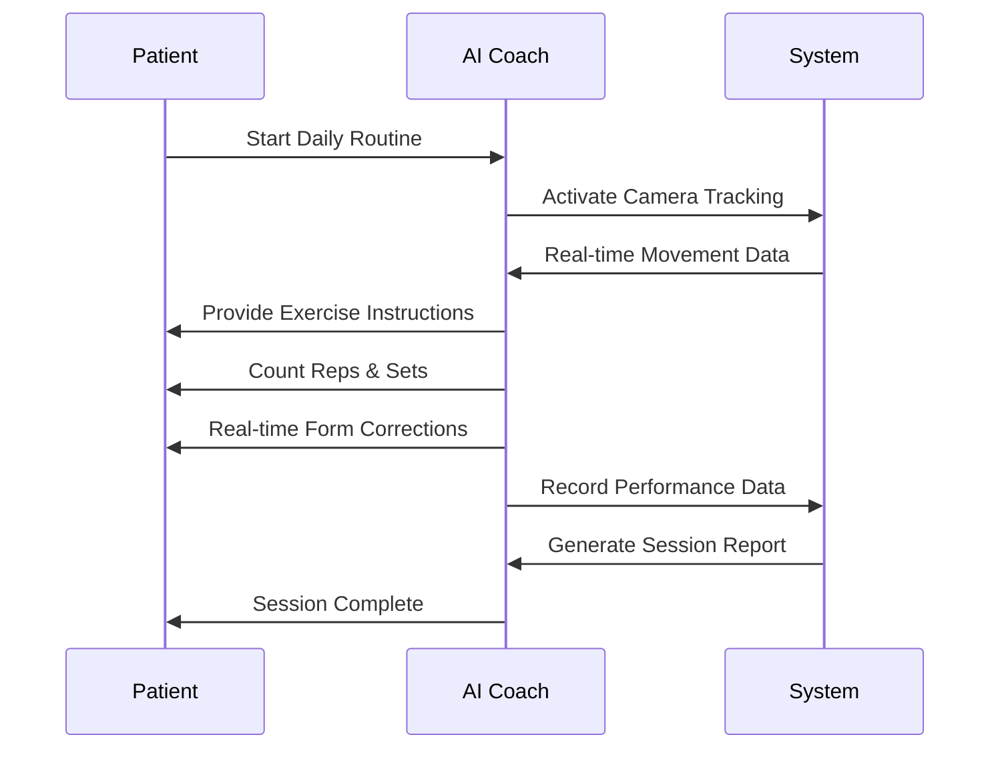
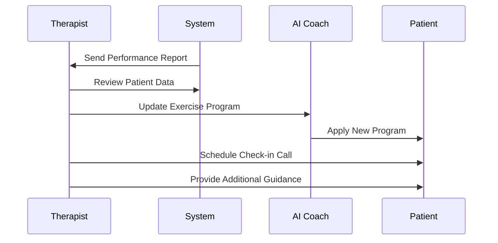

# AI-Driven Physiotherapy Workflow Architecture

## High-Level User Journey Flow

## Detailed User Role Interactions

## System Architecture Overview

## Key User Flows

### 1. Patient Onboarding Flow

### 2. Daily Exercise Session Flow

### 3. Therapist Review & Adaptation Flow

## Vision Points Mapping

| Vision Point | Implementation        | Key Features                                                                 |
| ------------ | --------------------- | ---------------------------------------------------------------------------- |
| **Vision 1** | Initial Consultation  | Remote video assessment, 3D anatomy explanation, personalized treatment plan |
| **Vision 2** | AI Coach Supervision  | Real-time tracking, corrective guidance, exercise counting, motivation       |
| **Vision 3** | AI Persona            | Voice interface, animated character, personalized digital therapist          |
| **Vision 4** | Performance Reporting | Automated data collection, detailed analytics, progress visualization        |
| **Vision 5** | Adaptive Care         | Live program adjustments, therapist oversight, continuous optimization       |

## Technology Stack

- **Frontend**: React/TypeScript web app, mobile app
- **AI/ML**: Computer vision, pose estimation, natural language processing
- **Backend**: Node.js/Python API, real-time data processing
- **Database**: PostgreSQL for patient data, Redis for session data
- **Video**: WebRTC/Zoom integration for consultations
- **Cloud**: AWS/Azure for scalable infrastructure
- **Analytics**: Real-time performance tracking and reporting

This architecture supports the complete physiotherapy journey from initial assessment through ongoing AI-guided treatment with human oversight and continuous adaptation.
